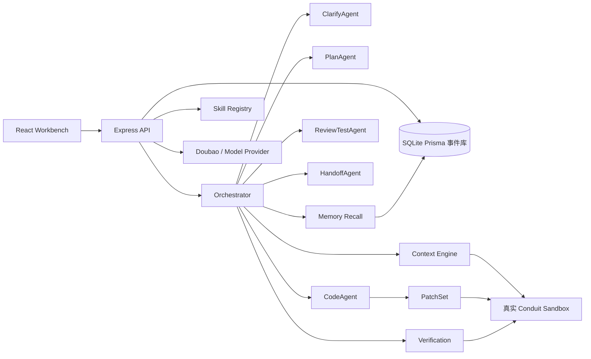

# 架构与技术说明

## 系统架构图

## 运行流程

1. Workbench 将自然语言需求提交到 `POST /api/runs`。
2. 后端创建 `Run` 和初始 `RunEvent`。
3. Orchestrator 以追加事件的方式记录每个阶段。
4. ClarifyAgent 生成 `RequirementDsl`，或在信息不足时生成阻塞式澄清问题。
5. Skill Registry 选择最匹配的 Skill。
6. PlanAgent 生成 `ImplementationPlan`。
7. Context Engine 只读取计划和搜索命中的 sandbox 文件。
8. CodeAgent 输出结构化 `PatchSet`。
9. Sandbox Runner 将补丁应用到 `apps/conduit-sandbox`。
10. Verification 执行白名单验证命令。
11. 验证失败时进入 `repairing`，并记录 `ReviewTestAgent` 的失败摘要。
12. HandoffAgent 汇总变更文件、验证结果、风险和 PR 草稿。
13. 成功 run 会沉淀为 `Memory`，供后续相似需求召回。

## 上下文工程

Context Engine 避免把整个仓库直接塞给模型，而是组合以下来源：

- 选中 Skill 声明的候选文件。
- PlanAgent 生成的 `rg` 搜索提示。
- 保证读取范围仍在 sandbox 内的路径守卫。
- `PackedContext` 中记录的文件读取原因。

没有被 Context Engine 读取的文件不会被当作证据使用。

## Skill 抽象

Skill 是小型能力模块，包含：

- `name`
- `version`
- `description`
- `tags`
- `match(input)`
- `plan(input)`

当前默认注册的 Skill：

- `add-article-derived-metric`：L1 前端文章阅读指标。
- `add-article-cover-image`：L2 跨栈文章 `coverImage` 字段。
- `add-article-share-link`：L2 文章详情页复制链接交互。
- `add-article-draft-workflow`：L3 全栈文章草稿流程。

新增需求模式应优先新增 Skill，而不是修改 Orchestrator 主流程。

## Sandbox 验证 API

- `POST /api/sandbox/verify` 默认执行 Conduit 验证命令：`npm run test` 和 `npm run build -w frontend`。
- 接口也接受受限的 `commands` 数组，仍然经过 sandbox runner 白名单。
- Workbench 右侧提供“沙箱验证”动作，可以在不创建新 Run 的情况下验证真实 Conduit sandbox。

## 事件溯源与重放

事件库使用：

- `Run`
- `RunEvent`
- `ModelCall`
- `Artifact`
- `SkillRecord`
- `Memory`

Replay 会创建一个新 run，并用 `replay.started` 元数据指向源 run 和所选阶段，不会覆盖旧事件。

## 可观测性

系统按 run 记录 `ModelCall`。规则驱动的 MVP Agent 会记录 `rule-based-mvp` 调用，`POST /api/model/health` 会记录真实 Doubao 调用。Workbench 会聚合 tokens、延迟和失败信息。

## 安全与合规

- 密钥只从 `.env` 加载。
- `.env.example` 只包含占位符。
- 日志和文档不得包含真实 API key 或 token。
- Sandbox 写入有路径守卫。
- Shell 命令由白名单控制。
- 原始题面文档不放入上传目录，避免示例凭据被误传。
